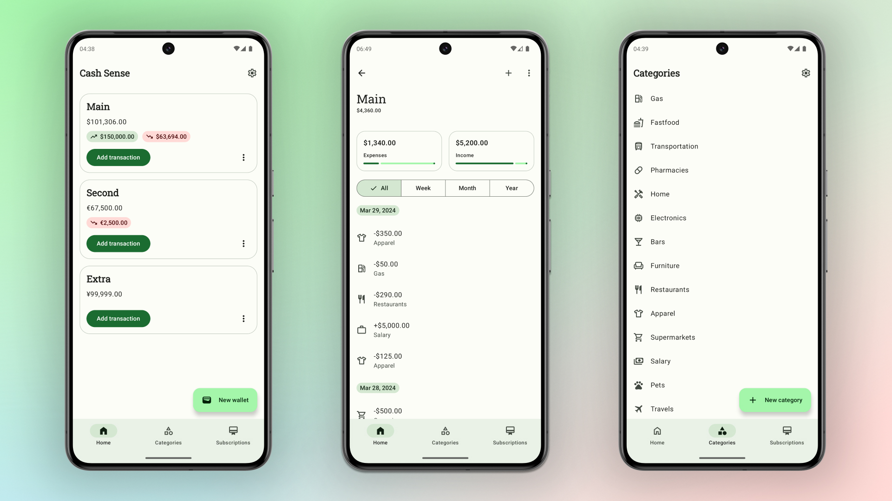

# Cash Sense
It's a mobile app designed to help users manage their finances effectively. Whether you want to create wallets in different currencies, set up categories for transactions, or track subscription payment dates, Cash Sense has you covered.

## Features
- **Wallets** - Easily create multiple wallets with support for various currencies. Keep your finances organized by managing different currencies in separate wallets.

- **Categories** - Categorize your transactions for a clearer overview of your spending patterns. Customize categories based on your unique financial needs.

- **Subscriptions** - Never miss a payment again. Set up and track subscription payments to stay on top of your financial commitments.

## Screenshots

## Libraries
* [ViewModel][4]
* [Navigation][8]
* [Hilt][5]
* [Kotlin Coroutines][6]
* [Jetpack Compose][7]
* [Room][12]
* [Lottie][2]

## Contributing
Contributions are welcome! If you have any improvements or bug fixes in mind, feel free to submit a pull request.

## License
**Cash Sense** is distributed under the terms of the Apache License (Version 2.0). See the
[license](LICENSE) for more information.

[1]: https://kotlinlang.org/
[2]: https://github.com/airbnb/lottie/blob/master/android-compose.md
[4]: https://developer.android.com/topic/libraries/architecture/viewmodel
[5]: https://developer.android.com/training/dependency-injection/hilt-android
[6]: https://kotlinlang.org/docs/coroutines-overview.html
[7]: https://developer.android.com/jetpack/compose
[8]: https://developer.android.com/guide/navigation
[11]: https://m3.material.io/
[12]: https://developer.android.com/reference/androidx/room/package-summary